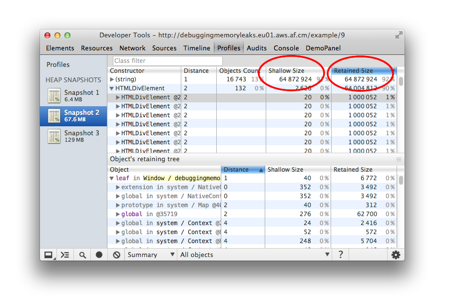
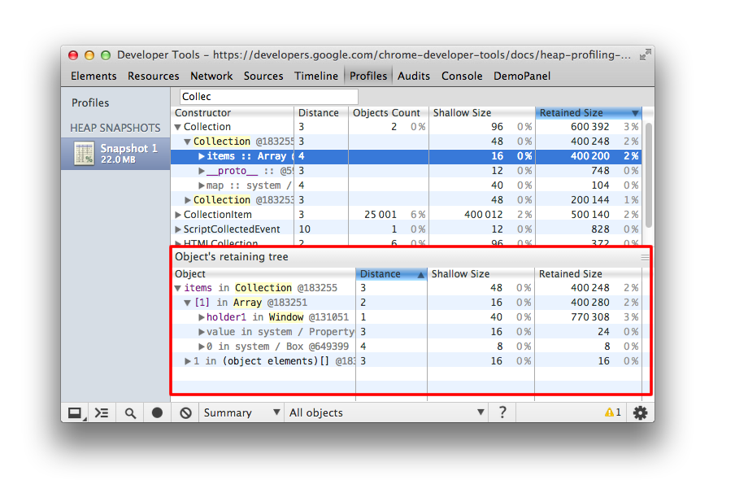
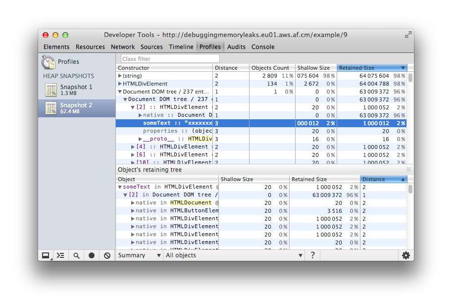
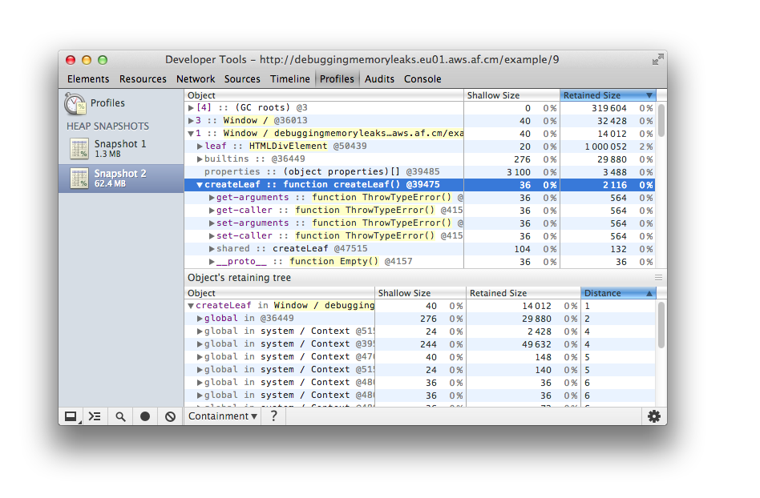
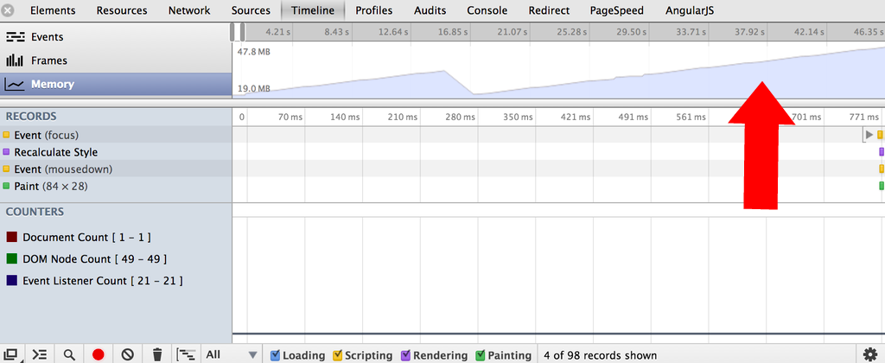
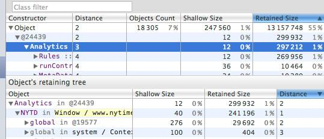
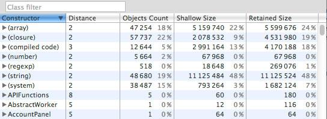
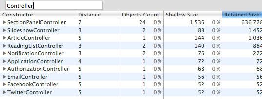

{{+bindTo:partials.standard_devtools_article}}

# JavaScript Memory Profiling

A **memory leak** is a gradual loss of available computer memory. It occurs when a program repeatedly fails to return memory it has obtained for temporary use. JavaScript web apps can often suffer from similar memory related issues that native applications do, such as **leaks** and bloat but they also have to deal with **garbage collection pauses.**

Although JavaScript uses garbage collection for automatic memory management, [effective](http://www.html5rocks.com/en/tutorials/memory/effectivemanagement/) memory management is still important. In this guide we will walk through profiling memory issues in JavaScript web apps. Be sure to try the [supporting demos](#supporting-demos) when learning about features to improve your awareness of how the tools work in practice.

Read the <a href="memory-analysis-101.html">Memory 101</a> page to become familiar with the terms used in this document.

<strong>Note:</strong> Some of these features we will be using are currently only available in <a href="http://www.google.com/intl/en/chrome/browser/canary.html">Chrome Canary</a>. We recommend using this version to get the best memory profiling tooling for your applications.

## Questions to ask yourself

In general, there are three questions you will want to answer when you think you have a memory leak:

* **Is my page using too much memory?** - the [Timeline memory view](#memory_mode) and [Chrome task manager](#chrome_task_manager) can help you identify if you’re using too much memory. Memory view can track the number of live DOM nodes, documents and JS event listeners in the inspected render process. As a rule of thumb: avoid holding references to DOM elements you no longer need to use, unbind unneeded event listeners and take care when storing large chunks of date you aren't going to use.

* **Is my page free of memory leaks?** - the [Object allocation tracker](#object_allocation_tracker) can help you narrow down leaks by looking at JS object allocation in real-time. You can also use the [heap profiler](#heap_profiler) to take JS heap snapshots, analyze memory graphs and compare snapshots to discover what objects are not being cleaned up by garbage collection.

* **How frequently is my page forcing garbage collection?** - if you are GCing frequently, you may be allocating too frequently. The [Timeline memory view](#identifying_a_memory_problem_with_the_devtools_timeline) can help you identify pauses of interest.

**Table of contents**

## Terminology and Fundamentals

This section describes common terms used in **memory analysis**, and is applicable to a variety of memory profiling tools for different languages. The terms and notions described here are used in the Heap Profiler UI and the corresponding documentation.

It helps to become familiar with these to use the tool effectively. If you have ever worked with either the Java, .NET, or some other memory profiler then this may be a refresher.

### Object sizes

Think of memory as a graph with primitive types (like numbers and strings) and objects (associative arrays). It might visually be represented as a graph with a number of interconnected points as follows:

An object can hold memory in two ways:

* Directly by the object itself

* Implicitly by holding references to other objects, and therefore preventing those objects from being automatically disposed by a garbage collector (**GC** for short).

When working with the Heap Profiler in DevTools (a tool for investigating memory issues found under "Profiles"), you will likely find yourself looking at a few different columns of information. Two that stand out are <strong>Shallow Size</strong> and <strong>Retained Size</strong>, but what do these represent?

#### Shallow size

This is the size of memory that is held by the object itself.

Typical JavaScript objects have some memory reserved for their description and for storing immediate values. Usually, only arrays and strings can have a significant shallow size. However, strings and external arrays often have their main storage in renderer memory, exposing only a small wrapper object on the JavaScript heap.

Renderer memory is all memory of the process where an inspected page is rendered: native memory + JS heap memory of the page + JS heap memory of all dedicated workers started by the page. Nevertheless, even a small object can hold a large amount of memory indirectly, by preventing other objects from being disposed of by the automatic garbage collection process.

#### Retained size

This is the size of memory that is freed once the object itself is deleted along with its dependent objects that were made unreachable from **GC roots**.

**GC roots** are made up of *handles* that are created (either local or global) when making a reference from native code to a JavaScript object outside of V8. All such handles can be found within a heap snapshot under **GC roots** > **Handle scope** and **GC roots** > **Global handles**. Describing the handles in this documentation without diving into details of the browser implementation may be confusing. Both GC roots and the handles are not something you need to worry about.

There are lots of internal GC roots most of which are not interesting for the users. From the applications standpoint there are following kinds of roots:

* Window global object (in each iframe). There is a distance field in the heap snapshots which is the number of property references on the shortest retaining path from the window.

* Document DOM tree consisting of all native DOM nodes reachable by traversing the document. Not all of them may have JS wrappers but if they have the wrappers will be alive while the document is alive.

* Sometimes objects may be retained by debugger context and DevTools console (e.g. after console evaluation).

<strong>Note:</strong> We recommend users to do heap snapshots with clear console and no active breakpoints in the debugger.

The memory graph starts with a root, which may be the `window` object of the browser or the `Global` object of a Node.js module. You don't control how this root object is GC'd.

Whatever is not reachable from the root gets GC.

<strong>Note:</strong> Both the Shallow and Retained size columns represent data in bytes.

### Object's Retaining Tree

As we introduced earlier, the heap is a network of interconnected objects. In the mathematical world, this structure is called a *graph* or memory graph. A graph is constructed from *nodes* connected by means of *edges*, both of which are given labels.

* **Nodes** (*or objects*) are labelled using the name of the *constructor *function that was used to build them

* **Edges** are labelled using the names of *properties*.

Later in this guide you will learn how to record a profile using the Heap Profiler. Some of the eye-catching things we can see in the Heap Profiler recording below include distance: the distance from the GC root. If almost all the objects of the same type are at the same distance, and a few are at a bigger distance, that's something worth investigating.

### Dominators

Dominator objects are comprised of a tree structure because each object has exactly one dominator. A dominator of an object may lack direct references to an object it dominates, that is, the dominators tree is not a spanning tree of the graph.

In the diagram above:

* Node 1 dominates node 2
* Node 2 dominates nodes 3, 4 and 6
* Node 3 dominates node 5
* Node 5 dominates node 8
* Node 6 dominates node 7

In the example below, node `#3` is the dominator of `#10`, but `#7` also exists in every simple path from GC to `#10`. Therefore, an object B is a dominator of an object A if B exists in every simple path from the root to the object A.

### V8 Specifics

In this section we describe some memory-related topics that correspond specifically to the **V8 JavaScript virtual machine **(V8 VM or VM). When profiling memory, it is helpful to understand why heap snapshots look this way.

#### JavaScript Object Representation

There are three primitive types:

* Numbers (e.g 3.14159..)
* Booleans (true or false)
* Strings (e.g 'Werner Heisenberg')

They cannot reference other values and are always leafs or terminating nodes.

**Numbers** can be stored as either:

* an immediate 31-bit integer values called **small integers** (*SMIs*), or

* heap objects, referred to as **heap numbers**. Heap numbers are used for storing values that do not fit into the SMI form, such as *doubles*, or when a value needs to be *boxed*, such as setting properties on it.

**Strings** can be stored in either:

* the **VM heap**, or

* externally in the **renderer’s memory**. A *wrapper object* is created and used for accessing external storage where, for example, script sources and other content that is received from the Web is stored, rather than copied onto the VM heap.

Memory for new JavaScript objects is allocated from a dedicated JavaScript heap (or **VM heap**).These objects are managed by V8's garbage collector and therefore, will stay alive as long as there is at least one strong reference to them.

**Native objects **are everything else which is not in the JavaScript heap. Native object, in contrast to heap object, is not managed by the V8 garbage collector throughout it’s lifetime, and can only be accessed from JavaScript using its JavaScript wrapper object.

**Cons string **is an object that consists of pairs of strings stored then joined, and is a result of concatenation. The joining of the *cons string* contents occurs only as needed. An example would be when a substring of a joined string needs to be constructed.

For example, if you concatenate **a** and **b**, you get a string (a, b) which represents the result of concatenation. If you later concatenated **d** with that result, you get another cons string ((a, b), d).

**Arrays** - An Array is an Objectwith numeric keys. They are used extensively in the V8 VM for storing large amounts of data. Sets of key-value pairs used like dictionaries are backed up by arrays.

A typical JavaScript object can be one of two array types used for storing:

* named properties, and

* numeric elements

In cases where there is a very small number of properties, they can be stored internally in the JavaScript object itself.

**Map** - an object that describes the kind of object and its layout. For example, maps are used to describe implicit object hierarchies for [fast property access](https://developers.google.com/v8/design.html#prop_access).

#### Object Groups

Each native objects group is made up from objects that hold mutual references to each other. Consider for example a DOM subtree, where every node has a link to its parent and links to the next child and next sibling, thus forming a connected graph. Note that native objects are not represented in the JavaScript heap — that's why they have zero size. Instead, wrapper objects are created.

Each wrapper object holds a reference to the corresponding native object, for redirecting commands to it. In its own turn, an object group holds wrapper objects. However, this doesn't create an uncollectable cycle, as GC is smart enough to release object groups whose wrappers are no longer referenced. But forgetting to release a single wrapper will hold the whole group and associated wrappers.

## Prerequisites and helpful tips

### Chrome Task Manager

<strong>Note:</strong> When profiling memory issues in Chrome, it is a good idea to setup a <a href="clean-testing-environment.html">clean-room testing environment</a>.

Using the Chrome Task Manager you can quickly see if a page is consuming a lot of memory by monitoring the memory columns while performing actions that may be causing this to happen. The Task Manager is accessed from the Chrome menu > Tools or by pressing Shift + Esc.

Once open, right-click on the heading area of the columns and enable the JavaScript memory column.

### Identifying a Memory Problem with the DevTools Timeline

The first step in solving any performance problem is having the ability to show proof that the problem exists. This means being able to create a reproducible test that can be used to take a baseline measurement of the problem. Without a reproducible program, you cannot reliably measure the problem. Further, without a baseline measurement, there is no way of knowing that any changes made are improving performance.

The **Timeline panel** is helpful for determining when a problem exists. It gives a complete overview of where time is spent when loading and interacting with your web app or page. All events, from loading resources to parsing JavaScript, calculating styles, garbage collection pauses, and repainting are plotted on a timeline.

When investigating memory issues, the Timeline panel’s **Memory view** can be used for tracking:

* total allocated memory - is memory usage growing?

* number of DOM nodes

* number of documents and

* the number of event listeners allocated.

To read more about how to isolate problems that might be causing leaks during your memory profiling sessions, see <a href="http://coding.smashingmagazine.com/2012/06/12/javascript-profiling-chrome-developer-tools/">Memory profiling with the Chrome DevTools</a> by Zack Grossbart.

#### **Proving a Problem Exists**

The first thing to do is identify a sequence of actions you suspect is leaking memory. This could be anything from navigating around a site, hovering, clicking, or otherwise somehow interacting with page in a way that seems to negatively impact performance more over time.

On the Timeline panel start recording (Ctrl + E or Cmd + E) and perform the sequence of actions you want to test. To force a full garbage collection click the trash icon () at the bottom.

Below we see a memory leak pattern, where some nodes are not being collected:

If after a few iterations you see a [sawtooth](http://en.wikipedia.org/wiki/Sawtooth_wave) shaped graph (in the memory pane at the top), you are allocating lots of shortly lived objects. But if the sequence of actions is not expected to result in any retained memory, and the DOM node count does not drop down back to the baseline where you began, you have good reason to suspect there is a leak.

Once you’ve confirmed that the problem exists, you can get help identifying the source of the problem using the **heap profiler **on the **Profiles panel**.

    <strong>Example:</strong>
    Try out this example of <a href="demos/memory/example1.html">memory growth</a> where you can practice how to effectively use Timeline memory mode.

### Garbage Collection

A *garbage collector* (such as the one in V8) needs to be able to locate objects in your application which are *live*, as well as, those which are considered *dead* (garbage*)* and are *unreachable*.

If **garbage collection** (GC) misses any dead objects due to logical errors in your JavaScript then the memory consumed by these objects cannot be reclaimed. Situations like this can end up slowing down your application over time.

This often happens when you’ve written your code in such a way that variables and event listeners you don’t require are still referenced by some code. While these references are maintained, the objects cannot be correctly cleaned up by GC.

Remember to check and nullify variables that contain references to DOM elements which may be getting updated/destroyed during the lifecycle of your app. Check object properties which may reference other objects (or other DOM elements). Be sure to keep an eye on variable caches which may accumulate over time.

## Heap Profiler

### Taking a snapshot

On the Profiles panel, choose ** *Take Heap Snapshot* **, then click **Start** or press Cmd + E or Ctrl + E:

**
**Snapshots are initially stored in the renderer process memory. They are transferred to the DevTools on demand, when you click on the snapshot icon to view it. After the snapshot has been loaded into DevTools and has been parsed, the number below the snapshot title appears and shows the total size of the [reachable](memory-analysis-101.html#retaining-paths) JavaScript objects:

    <strong>Example:</strong>
    Try out this example of <a href="demos/memory/example2.html">garbage collection in action</a> and monitor memory usage in the Timeline.

### Clearing snapshots

Snapshots can be removed (both from DevTools and renderers memory) by pressing the Clear all profiles icon ():

<strong>Note:</strong> Closing the DevTools window will not delete collected profiles from the renderers memory. When reopening DevTools, all previously taken snapshots will reappear in the list of snapshots.

Remember that we mentioned earlier you can force GC from the DevTools as part of your snapshot workflow. When taking a Heap Snapshot, it is automatically forced. In Timeline it can be very convenient to force a GC by clicking on the trash can (Collect Garbage) button ().

<strong>Example:</strong> Try out this example of <a href="demos/memory/example3.html">scattered objects</a> and profile it using the Heap Profiler. You should see a number of (object) item allocations.

### Switching between snapshot views

A snapshot can be viewed from different perspectives for different tasks. To switch between views, use the selector at the bottom of the view:

**
**

There are three default views:

* **Summary — **shows objects grouped by the constructor name;

* **Comparison — **displays difference between two snapshots;

* **Containment — **allows exploration of heap contents;

The **Dominators **view, which can be enabled via the Settings panel **— **shows the [dominators tree.](memory-analysis-101.html#dominators) and can be useful to find accumulation points.

### Looking up color coding

Properties and property values of objects have different types and are colored accordingly. **
**Each property has one of four types:

* **a: property — **a regular property with a name, accessed via the . (dot) operator, or via [ ] (brackets) notation, e.g. ["foo bar"];

* **0: element — **a regular property with a numeric index, accessed via [ ] (brackets) notation;

* **a:**** context var — **a variable in a function context, accessible by its name from inside a function closure;

* **a:**** system prop — **property added by the JavaScript VM, not accessible from JavaScript code.

Objects designated as `System `do not have a corresponding JavaScript type. They are part of JavaScript VM's object system implementation. V8 allocates most of its internal objects in the same heap as the user's JS objects. So these are just v8 internals.

## Views in detail

### Summary view

Initially, a snapshot opens in the Summary view, displaying object totals, which can be expanded to show instances:

Top-level entries are "total" lines. They display:

* the **Constructor represents **all objects created using this constructor

* the **number of object instances** is displayed in the # column

* the **Shallow size** column displays the sum of [shallow sizes](memory-analysis-101.html#object-sizes) of all objects created by a certain constructor function

* the **Retained size** column displays the maximum retained size among the same set of objects

* the **Distance **displays the distance to the root using the shortest simple path of nodes.

After expanding a total line in the upper view, all of its instances are displayed. For each instance, its shallow and retained sizes are displayed in the corresponding columns. The number after the @ character is the objects’ unique ID, allowing you to compare heap snapshots on per-object basis.

<strong>Example:</strong> Try this <a href="heap-profiling-summary.html">demo page</a> (opens in a new tab) to understand how the Summary view can be used.

Remember that yellow objects have JavaScript references on them and red objects are detached nodes which are referenced from one with a yellow background.

### Comparison view

This view is used to compare multiple snapshots to each other so that you can see what the difference between them are in order to find leaked objects. To verify that a certain application operation doesn't create leaks (e.g. usually a pair of direct and reverse operations, like opening a document, and then closing it, should not leave any garbage), you may follow the scenario below:

1. Take a heap snapshot before performing an operation;

2. Perform an operation (interact with a page in some way that you believe to be causing a leak);

3. Perform a reverse operation (do the opposite interaction and repeat it a few times);

4. Take a second heap snapshot and change the view of this one to Comparison, comparing it to snapshot 1.

In the Comparison view, the difference between two snapshots is displayed. When expanding a total entry, added and deleted object instances are shown:

<strong>Example:</strong> Try this <a href="heap-profiling-comparison.html">demo page</a> (opens in a new tab) to get an idea how to use snapshot comparison for detecting leaks.

### Containment view

The Containment view is essentially a "bird's eye view" of your application's objects structure. It allows you to peek inside function closures, to observe VM internal objects that together make up your JavaScript objects, and to understand how much memory your application uses at a very low level.

The view provides several entry points:

* **DOMWindow**** objects** — these are objects considered as "global" objects for JavaScript code;

* **GC roots** — actual GC roots used by VM's garbage collector;

* **Native objects** — browser objects that are "pushed" inside the JavaScript virtual machine to allow automation, e.g. DOM nodes, CSS rules (see the next section for more details.)

Below is the example of a populated Containment view:

  <strong>Example:</strong> Try this <a href="heap-profiling-containment.html">demo page</a> (opens in a new tab) for finding out how to explore closures and event handlers using the view.

<strong>A tip about closures</strong>

It helps a lot to name the functions so you can easily distinguish between closures in the snapshot. For example, this example does not use named functions:

<pre>
function createLargeClosure() {
  var largeStr = new Array(1000000).join('x');

  var lC = function() { // this is NOT a named function
    return largeStr;
  };

  return lC;
}
</pre>

Whilst this example does:

<pre>
function createLargeClosure() {
  var largeStr = new Array(1000000).join('x');

  var lC = function lC() { // this IS a named function
    return largeStr;
  };

  return lC;
}
</pre>

</a>

    <strong>Examples:</strong>
    Try out this example of <a href="demos/memory/example7.html">why eval is evil</a> to analyze the impact of closures on memory. You may also be interested in following it up with this example that takes you through recording <a href="/devtools/docs/demos/memory/example8.html">heap allocations</a>.

### Uncovering DOM leaks

A unique ability of the tool is to reflect bidirectional dependencies between browser native objects (DOM nodes, CSS rules) and JavaScript objects. This helps to discover otherwise invisible leaks happening due to forgotten detached DOM subtrees floating around.

DOM leaks can be bigger than you think. Consider the following sample - when is the #tree GC?

<pre>
  var select = document.querySelector;
  var treeRef = select("#tree");
  var leafRef = select("#leaf");
  var body = select("body");

  body.removeChild(treeRef);

  //#tree can't be GC yet due to treeRef
  treeRef = null;

  //#tree can't be GC yet due to indirect
  //reference from leafRef

  leafRef = null;
  //#NOW can be #tree GC
</pre>

<code>#leaf</code> maintains a reference to it's parent (parentNode) and recursively up to <code>#tree</code>, so only when leafRef is nullified is the WHOLE tree under <code>#tree</code> a candidate for GC.

    <strong>Examples:</strong>
    Try out this example of <a href="demos/memory/example6.html">leaking DOM nodes</a> to understand where DOM nodes can leak and how to detect them. You can follow it up by also looking at this example of <a href="/devtools/docs/demos/memory/example9.html">DOM leaks being bigger than expected</a>.

To read more about DOM leaks and memory analysis fundamentals checkout <a href="http://slid.es/gruizdevilla/memory">Finding and debugging memory leaks with the Chrome DevTools</a> by Gonzalo Ruiz de Villa.

Native objects are most easily accessible from Summary and Containment views — there are dedicated entry nodes for them:

    <strong>Example:</strong>
    Try this <a href="heap-profiling-dom-leaks.html">demo</a> (opens in a new tab) to play with detached DOM trees.

### Dominators view

The Dominators view shows the dominators tree for the heap graph. The Dominators view looks similar to the Containment view, but lacks property names. This is because a dominator of an object may lack direct references to it, that is, the dominators tree is not a spanning tree of the graph. But this only serves for good, as helps us to identify memory accumulation points quickly.

<strong>Note:</strong> In Chrome Canary, Dominators view can be enabled by going to Settings > Show advanced heap snapshot properties and restarting the DevTools.

    <strong>Examples:</strong>
    Try this <a href="heap-profiling-dominators.html">demo</a> (opens in a new tab) to train yourself in finding accumulation points. Follow it up with this example of running into <a href="/devtools/docs/demos/memory/example10.html">retaining paths and dominators</a>.

## Object allocation tracker

The **object tracker** combines the detailed snapshot information of the [heap profiler](#heap_profiler) with the incremental updating and tracking of the Timeline panel. Similar to these tools, tracking objects’ heap allocation involves starting a recording, performing a sequence of actions, then stop the recording for analysis.

The object tracker takes heap snapshots periodically throughout the recording (as frequently as every 50 ms!) and one final snapshot at the end of the recording. The heap allocation profile shows where objects are being created and identifies the retaining path.

**Enabling and using the Object Tracker**

To begin using the Object Tracker:

1. Make sure you have the latest [Chrome Canary](https://www.google.com/intl/en/chrome/browser/canary.html).

2. Open the Developer Tools and click on the gear icon in the lower right.

3. Now, open the Profiler panel, you should see a profile called "Record Heap Allocations"

The bars at the top indicate when new objects are found in the heap.  The height of each bar corresponds to the size of the recently allocated objects, and the color of the bars indicate whether or not those objects are still live in the final heap snapshot: blue bars indicate objects that are still live at the end of the timeline, gray bars indicate objects that were allocated during the timeline, but have since been garbage collected.

</a>

In the example above, an action was performed 10 times.  The sample program caches five objects, so the last five blue bars are expected.  But the leftmost blue bar indicates a potential problem. You can then use the sliders in the timeline above to zoom in on that particular snapshot and see the objects that were recently allocated at that point.

Clicking on a specific object in the heap will show its retaining tree in the bottom portion of the heap snapshot. Examining the retaining path to the object should give you enough information to understand why the object was not collected, and you can make the necessary code changes to remove the unnecessary reference.

## Memory Profiling FAQ

**Q: I don't see all the properties of objects, I don't see non-string values for them! Why?**

Not all properties are actually stored on the JavaScript heap. Some of them are implemented using getters that execute native code. Such properties are not captured in heap snapshots in order to avoid the cost of calling getters and to avoid possible program state changes if getters are not "pure" functions. Also, non-string values such as numbers are not captured in an attempt to reduce snapshot size.

**Q: What does the number after the ****@**** char mean — is this an address or an ID? Is the ID value really unique?**

This is an object ID. Displaying an object's address makes no sense, as objects are moved during garbage collections. Those object IDs are real IDs — that means, they persist among multiple snapshots taken and are unique. This allows precise comparison between heap states. Maintaining those IDs adds an overhead to GC cycles, but it is only initiated after the first heap snapshot was taken — no overhead if heap profiles aren't used.

**Q: Are "dead" (unreachable) objects included in snapshots?**

No. Only reachable objects are included in snapshots. Also, taking a snapshot always starts with doing a GC.

<strong>Note:</strong>At the time of writing, we are planning on avoiding this GC to reduce the drop in used heap size when taking heap snapshots. This has yet to be implemented but garbage would still be out of the snapshot.

**Q: What comprises GC roots?**

Many things:

* built-in object maps;

* symbol table;

* stacks of VM threads;

* compilation cache;

* handle scopes;

* global handles.

**Q: I’ve been told to use the Heap Profiler and Timeline Memory view for detecting memory leaks. What tool should be used first?**

The Timeline. Use it to diagnose excessive memory usage when you first notice your page has slowed down after extended use. Slowdown was once a classic symptom of a memory leak but it could also be something else – maybe you have a paint or network bottleneck in your page, so make sure to fix the real issue in your page.

To diagnose whether memory is the issue, go to the Timeline panel and Memory view. Hit the record button and interact with your application, repeating any steps you feel may be causing a leak. Stop the recording. The graph you see will display the memory allocated to your application. If it happens to be consuming an increasing amount of this over time (without ever dropping), it’s an indication you may have a memory leak.

The profile for a healthy application should look more like a sawtooth curve as memory is allocated then freed when the garbage collector comes in. There’s nothing to worry about here – there’s always going to be a cost of doing business in JavaScript and even an empty `requestAnimationFrame` will cause this type of sawtooth, you can’t avoid it. Just ensure it’s not sharp as that’s an indication a lot of allocations are being made, which can equate to a lot of garbage on the other side.

It's the rate of increase in the steepness of this curve that you need to keep an eye on.There is also a DOM node counter, Document counter and Event listener count in the Memory view which can be useful during diagnosis. DOM nodes use native memory and do not directly affect the JavaScript memory graph.

Once you suspect you have a memory leak, the Heap profiler can be used to discover the source of the leak.

**Q: I noticed a number of DOM nodes in the heap snapshot where some are highlighted in red and indicated as a "Detached DOM tree" whilst others are yellow. What does this mean?
**

You'll notice nodes of a few different colors. Red nodes (which have a darker background) do not have direct references from JavaScript to them, but are alive because they’re part of a detached DOM tree. There may be a node in the tree referenced from JavaScript (maybe as a closure or variable) but is coincidentally preventing the entire DOM tree from being garbage collected.

Yellow nodes (with a yellow background) however do have direct references from JavaScript. Look for yellow nodes in the same detached DOM tree to locate references from your JavaScript. There should be a chain of properties leading from the DOM window to the element (e.g `window.foo.bar[2].baz`).

An animation of where detached nodes fit into the overall picture can be seen below:

    <strong>Example:</strong>
    Try out this example of <a href="demos/memory/example4.html">detached nodes</a> where you can watch node evolution in the Timeline then take heap snapshots to find detached nodes.

**Q: What do the Shallow and Retained Size columns represent and what are the differences between them?**

So, objects can be kept in memory (be alive) in two different ways – either directly by another alive object (window and document are always alive objects) or implicitly by holding references from native part of the renderer (like DOM objects). The latter is what ends up preventing these objects from being disposed by GC automatically, causing leaks. The size of memory held by an object itself is known as the shallow size (generally, arrays and strings have larger shallow sizes).

An object of any size can hold a ton of memory if it prevents other objects from being disposed. The size of memory that can be freed once an object is deleted (and this its dependents made no longer reachable) is called the retained size.

**Q: There's a lot of data in the constructor and retained views. Where should I start digging into to discover if I have a leak?**

It's generally a good idea to begin investigation from the first object retained in your tree as retainers are sorted by distance (well, distance to the window).

The object retained with the shortest distance is usually your first candidate for causing a memory leak.

**Q: What's the difference between the different Summary, Comparison, Dominators and Containment views?**

You may get some mileage by switching between the different data views available at the bottom of the screen.

* Summary view helps you hunt down objects (and their memory use) based on type grouped by constructor name. This view is particularly helpful for tracking down DOM leaks.

* Comparison view helps you track down memory leaks, by displaying which objects have been correctly cleaned up by the garbage collector. Generally used to record and compare two (or more) memory snapshots of before and after an operation. The idea is that inspecting the delta in freed memory and reference count lets you confirm the presence and cause of a memory leak.

* Containment view provides a better view of object structure, helping us analyse objects referenced in the global namespace (i.e. window) to find out what is keeping them around. It lets you analyse closures and dive into your objects at a low level.

* Dominators view helps confirm that no unexpected references to objects are still hanging around (i.e that they are well contained) and that deletion/garbage collection is actually working.

**Q: What do the various constructor (group) entries in the Heap profiler correspond to?****
**

* **(global property)** – intermediate objects between a global object (like 'window') and an object referenced by it. If an object is created using a constructor Person and is held by a global object, the retaining path would look like [global] > (global property) > Person. This contrasts with the norm, where objects directly reference each other. We have intermediate objects for performance reasons. Globals are modified regularly and property access optimisations do a good job for non-global objects aren't applicable for globals.

* **(roots)** – The root entries in the retaining tree view are the entities that have references to the selected object. These can also be references created by the engine for its own purposes. The engine has caches which reference objects, but all such references are weak and won't prevent an object from being collected given that there are no truly strong references.

* **(closure)** – a count of references to a group of objects through function closures

* **(array, string, number, regexp)** – a list of object types with properties which reference an Array, String, Number or regular expression

* **(compiled code)** – simply, everything related to compiled code. Script is similar to a function but corresponds to a &lt;script&gt; body. SharedFunctionInfos (SFI) are objects standing between functions and compiled code. Functions are usually have a context, while SFIs do not.

* **HTMLDivElement**, **HTMLAnchorElement**, **DocumentFragment** etc – references to elements or document objects of a particular type referenced by your code.

Many of the other objects you may see were likely generated during the lifecycle of your code and can include event listeners as well as custom objects, like the controllers below:

**Q: Is there anything I should be turning off in Chrome that might be influencing my figures?**

When performing any type of profiling using the Chrome DevTools, it is recommended that you either run in incognito mode with all extensions disabled or start Chrome with a [custom](http://www.chromium.org/developers/how-tos/run-chromium-with-flags) user data directory (`--user-data-dir=""`).

Apps, extensions and even console logging can have an implicit impact on your figures and you want to keep them as reliable as possible.

**Closing remarks**

The JavaScript engines of today are highly capable of automatically cleaning garbage generated by our code in a number of situations. That said, they can only go so far and our applications are still prone to memory leaks caused by logical errors. Use the tools available to find out your bottlenecks and remember, don't guess it - test it.

## Supporting Demos

### Debugging Memory Leaks

Although we've mentioned them throughout this guide, a good set of end-to-end examples for testing various memory issues, ranging from growing memory leaking DOM nodes can be found summarized below. You may wish to experiment with them before attempting to use the tooling on your own more complex page or application.

<ul>
<li><a target="_blank" href="/devtools/docs/demos/memory/example1.html">Example 1: Growing memory</a></li>

<li><a target="_blank" href="/devtools/docs/demos/memory/example2.html">Example 2: Garbage collection in
action</a></li>

<li><a target="_blank" href="/devtools/docs/demos/memory/example3.html">Example 3: Scattered objects</a></li>

<li><a target="_blank" href="/devtools/docs/demos/memory/example4.html">Example 4: Detached nodes</a></li>

<li><a target="_blank" href="/devtools/docs/demos/memory/example5.html">Example 5: Memory and hidden
classes</a></li>

<li><a target="_blank" href="/devtools/docs/demos/memory/example6.html">Example 6: Leaking DOM nodes</a></li>

<li><a target="_blank" href="/devtools/docs/demos/memory/example7.html">Example 7: Eval is evil (almost
always)</a></li>

<li><a target="_blank" href="/devtools/docs/demos/memory/example8.html">Example 8: Recording heap
allocations</a></li>

<li><a target="_blank" href="/devtools/docs/demos/memory/example9.html">Example 9: DOM leaks bigger than
expected</a></li>

<li><a target="_blank" href="/devtools/docs/demos/memory/example10.html">Example 10: Retaining path</a></li>

<li><a target="_blank" href="/devtools/docs/demos/memory/example11.html">Example 11: Last exercise</a></li>
</ul>

Additional demos are available for:

* [Gathering scattered objects](heap-profiling-summary.html)

* [Verifying action cleanness](heap-profiling-comparison.html)

* [Exploring the heap contents](heap-profiling-containment.html)

* [Uncovering DOM leaks](heap-profiling-dom-leaks.html)

* [Finding accumulation points](heap-profiling-dominators.html)

## Extras

[Memory Management Masterclass](http://youtu.be/LaxbdIyBkL0) with Addy Osmani gives you a crash-course in debugging memory issues. The [slides](https://speakerdeck.com/addyosmani/javascript-memory-management-masterclass) for the presentation are available as well as the [example code](https://github.com/addyosmani/memory-mysteries).
<iframe width="560" height="315" src="//www.youtube.com/embed/LaxbdIyBkL0?rel=0" frameborder="0" allowfullscreen></iframe>

## Community Resources

There are a number of excellent resources written by the community on finding and fixing memory issues in web apps using the Chrome DevTools. Below are a selection of some you may find useful:

* [Finding and debugging memory leaks with the Chrome DevTools](http://slid.es/gruizdevilla/memory)

* [JavaScript profiling with the DevTools](http://coding.smashingmagazine.com/2012/06/12/javascript-profiling-chrome-developer-tools/)

* [Effective memory management at GMail scale](http://www.html5rocks.com/en/tutorials/memory/effectivemanagement/)

* [Chrome DevTools Revolutions 2013](http://www.html5rocks.com/en/tutorials/developertools/revolutions2013/)

* [Rendering and memory profiling with the DevTools](http://www.slideshare.net/matenadasdi1/google-chrome-devtools-rendering-memory-profiling-on-open-academy-2013)

* [Performance optimization with DevTools timeline and profile](http://addyosmani.com/blog/performance-optimisation-with-timeline-profiles/)

{{/partials.standard_devtools_article}}
